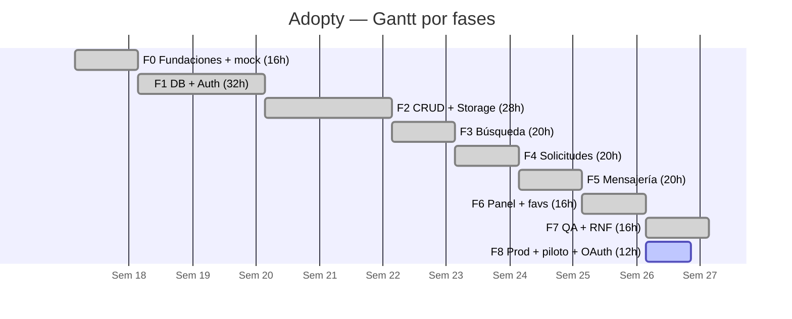

# Cronograma y ruta crítica — Adopty (10 semanas, 160 h)

## PERT / ruta crítica

**Crítica:** F0 → F1 → F2 → F4 → F5 → F7 → F8 (10 sem, holgura 0).
**Holgura ≤ 1 sem:** F3 (búsqueda) y F6 (panel) — independientes del flujo solicitudes→chat.
**Riesgo absorvido:** Google OAuth se movió a F8 (decisión 24 sep); Cloudinary nunca se necesitó
(fotos WebP ≤500 KB caben en el free tier).

## Hitos por semana

| Sem | Hito                                       | Estado                        |
| --- | ------------------------------------------ | ----------------------------- |
| 1   | Preview Vercel + base Astro                | ✅                            |
| 2–3 | Auth + DB + RLS en cloud                   | ✅                            |
| 3–4 | CRUD + Storage WebP                        | ✅                            |
| 5   | Búsqueda < 1 s + URL compartible           | ✅                            |
| 6   | Solicitudes con estados + RPC              | ✅                            |
| 7   | Chat realtime + no-leídos                  | ✅                            |
| 8   | Panel + favoritos                          | ✅                            |
| 9   | QA: 36 tests, rate-limit, legales, backups | ✅                            |
| 10  | Prod + piloto + OAuth + sustentación       | 🔶 en curso (OAuth pendiente) |
