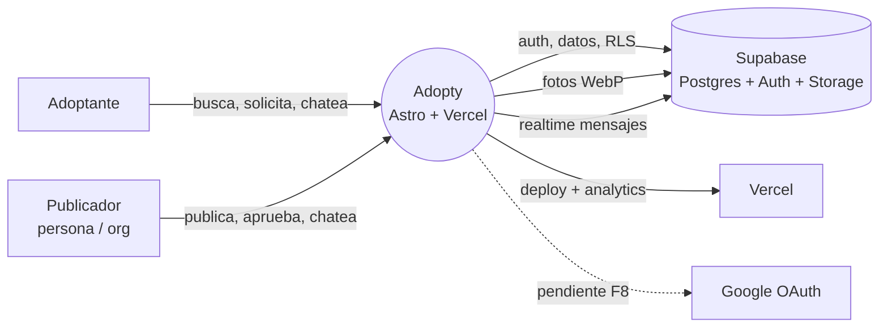
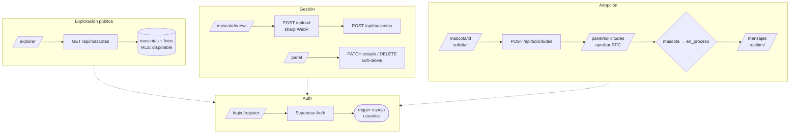

# DFD — Adopty (nivel contexto + nivel 1)

## Contexto

## Nivel 1 — flujos

## Diccionario de flujos

| Origen → Destino      | Datos                                                |
| --------------------- | ---------------------------------------------------- |
| Adoptante → Explorar  | `especie, tamano, sexo, q, orden, page`              |
| API → Adoptante       | `{items, total, page, totalPages}` (20/pág)          |
| Form → Upload         | multipart 1–5 fotos (≤5 MB, JPEG/PNG/WebP)           |
| Upload → Form         | `paths[]` WebP ≤500 KB                               |
| Detalle → Solicitudes | `{id_mascota, mensaje_inicial}`                      |
| Panel → Solicitudes   | `{accion: aprobar/rechazar}` (aprobar = RPC)         |
| Chat ⇄ Realtime       | `INSERT mensajes` por canal `chat:{mascota}:{a}:{b}` |
